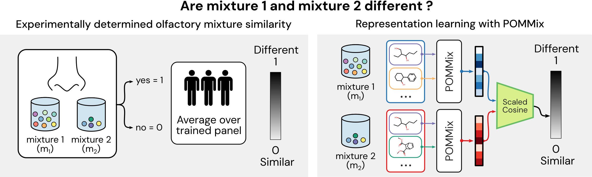
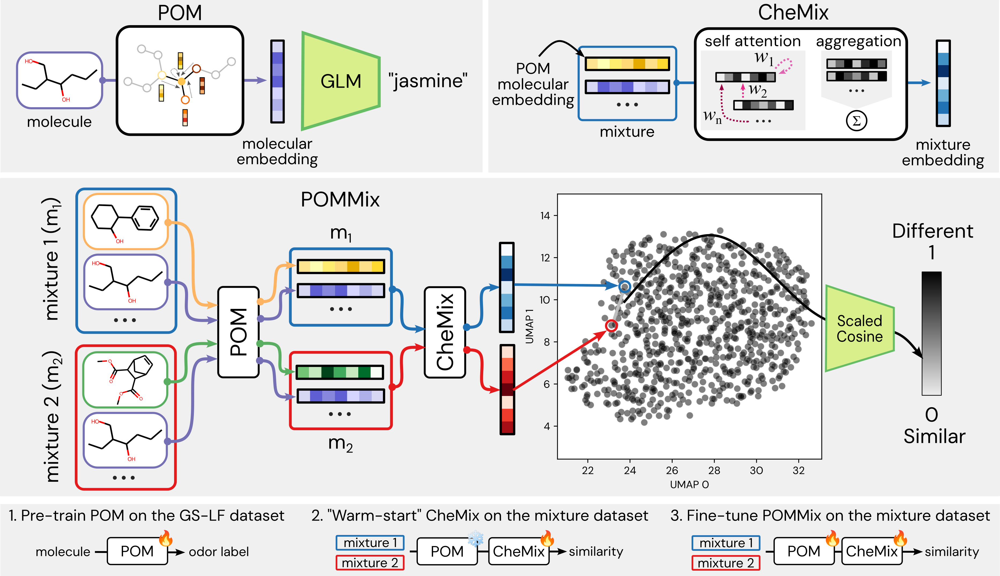

# From Molecules to Mixtures: Learning Representations of Olfactory Mixture Similarity using Inductive Biases

## Datasets
The `datasets` folder contains the olfactory properties of single molecules, obtained from the [OpenPOM version](https://github.com/BioMachineLearning/openpom) of the GoodScents-Leffingwell (GS-LF) dataset. This folder also contains the olfactory similarity metrics for mixtures, contained in `mixtures_combined.csv` obtained from [Snitz et al. (2013)](https://journals.plos.org/ploscompbiol/article?id=10.1371/journal.pcbi.1003184), [Bushdid et al. (2014)](https://www.science.org/doi/10.1126/science.1249168) and [Ravia et al. (2020)](https://www.nature.com/articles/s41586-020-2891-7). The SMILES strings of the components in the multimolecular mixtures can be found in `mixture_smi_definitions_clean_found_duplicates.csv`. 

## Splits

The `datasets` folder also contains the pre-determined random splits (prefix `random`), splitting by number of components in a mixture (in Figure 5a, prefix `ablate_components`), and the leave-molecules-out splits (LMO, in Figure 5b, prefix `lso_molecules`)

## Baselines (Figure 4)

The `datasets` folder contains the features used for the RDKit baselines `mixture_rdkit_definitions_clean_found_duplicates.csv` and the principal odor map (POM) embeddings used for the XGBoost models `mixture_pom_embeddings.npz`. To run the baselines, use the scripts and splits contained in the `scripts_baseline` folder.

## Models

`scripts_pom` contains the code to generate olfactory molecular embeddings by predicting the odor descriptors for a molecule based on the GS-LF dataset. 

`scripts_chemix` contains the code to take mixture embeddings to predict the olfactory similarity of two mixtures. 

`scripts_pommix` contains the code that trains both POM and CheMix end-to-end to improve the predictive performance of molecular embeddings generated from the POM.
